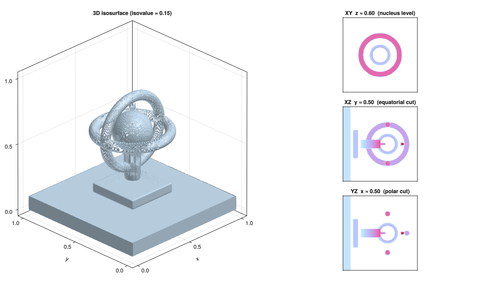
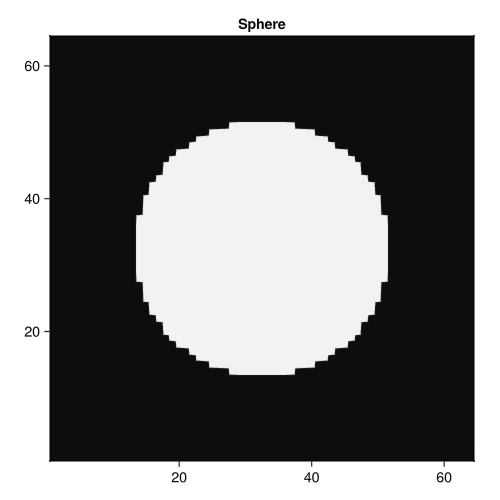
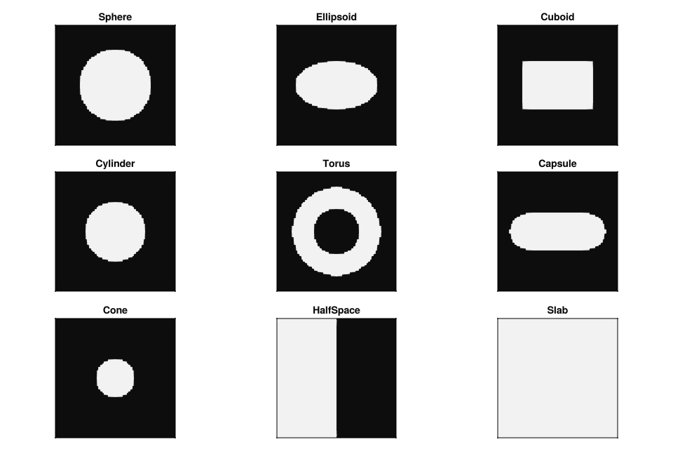
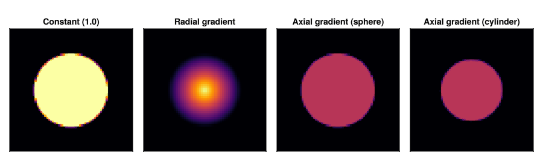
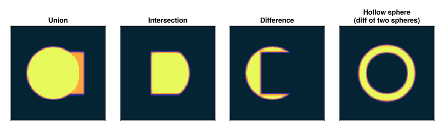
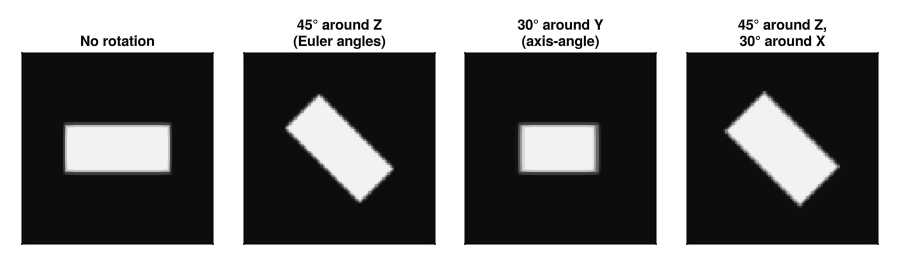

# VoxelShapes.jl



Place geometric shapes into a 3D voxel grid. Each shape carries a fill value (or a gradient function), and you can pick how boundary voxels are blended when a surface doesn't line up with the grid. Call `Array(world)` and you get a plain Julia array.

The main use case is any grid-based simulation that needs per-voxel scalar or vector properties defined by geometry. The library has no opinions about what the values mean.

## Installation

```julia
using Pkg
Pkg.add("VoxelShapes")
```

## Quick start

```julia
using VoxelShapes

N = 64
sphere = FillableSphere((0.5, 0.5, 0.5), 0.3, 1.0)

world = World(
    (N, N, N),        # grid dimensions in voxels
    (1/N, 1/N, 1/N),  # physical size of one voxel
    [sphere],
    0.0,              # background value
    NoAntiAliasing()
)

arr = Array(world)    # returns a 64×64×64 Float64 array
```

`World` is immutable. To add more shapes, use `add_shape(world, shape)`, which returns a new `World` with the shape appended.



## Shapes

Nine primitives are included.



```julia
FillableSphere(center, radius, fill_val)
FillableEllipsoid(center, (rx, ry, rz), fill_val)
FillableCuboid(center, (lx, ly, lz), fill_val)      # lx/ly/lz are full side lengths
FillableCylinder(center, radius, half_height, fill_val; axis=3)
FillableTorus(center, major_radius, minor_radius, fill_val; axis=3)
FillableCapsule(point_a, point_b, radius, fill_val)
FillableCone(center, base_radius, top_radius, half_height, fill_val; axis=3)
FillableSlab(point, normal, half_thickness, fill_val)
FillableHalfSpace(point, normal, fill_val)
```

`FillableCone` with `top_radius = 0` is a true cone; unequal nonzero radii give a frustum.

Shapes are evaluated in the order they were added to the world. The first shape whose containment test passes claims the voxel, with one exception: the background value doubles as a transparency sentinel. A shape that covers a voxel but produces a value equal to the background is treated as transparent there, so the next shape (or the background) shows through. This lets you punch holes by filling with the background value, but it also means you cannot deliberately paint the background value on top of a lower layer.

## Fill functions

The fill value argument can be any constant, but if you want spatial variation you can pass one of the built-in fill structs instead.



```julia
# Radial gradient: interpolates from inner_value at the center to outer_value at the surface
f = RadialGradient(1.0, 0.0)   # bright core, transparent shell

# Axial gradient: interpolates along a local axis from -1 to +1
f = AxialGradient(3, 0.0, 1.0) # dark bottom, bright top (local z-axis)
```

Because the convenience constructors wrap their `fill_val` argument in a closure, using a gradient requires the inner struct constructor. See `examples/03_fills.jl` for the full syntax.

Any callable that takes a 3-tuple of local coordinates and returns a scalar works as a fill function, as long as it is `isbits`-compatible (required for GPU use).

## CSG

Shapes can be combined with boolean operations.



```julia
csg_union(a, b)       # inside a or b
csg_intersect(a, b)   # inside both a and b
csg_diff(a, b)        # inside a but not b
csg_complement(a)     # everything outside a
```

Fill always delegates to the first operand. Operations can be nested.

## Rotation

`Rotated` wraps any shape and maps query points into local frame before the containment test. This means every shape gets rotation without needing its own rotation logic.



```julia
Rotated(shape, (αx, αy, αz))     # intrinsic ZYX Euler angles in radians
Rotated(shape, axis, angle)       # axis-angle
Rotated(shape, R)                 # explicit 3×3 SMatrix
```

The pivot defaults to `center(shape)`. You can pass an explicit pivot as the last argument.

## Anti-aliasing

When a surface doesn't align with the voxel grid, boundary voxels need some treatment.


`NoAntiAliasing` is a hard point test at the voxel center. `SuperResolutionAntiAliasing(n)` divides each voxel into n³ sub-samples and averages them. `SubpixelAntiAliasing` uses the signed distance function to estimate coverage analytically, one evaluation per voxel, with no inner loop. `GaussianAntiAliasing(σ, kernel_size)` convolves the boundary with a Gaussian for a softer edge. `AdaptiveAntiAliasing(inner)` wraps any strategy and skips the stencil for voxels that are clearly inside or outside.

For most use cases `AdaptiveAntiAliasing(SuperResolutionAntiAliasing(4))` is a good starting point.

## Interpolation

When sub-voxel samples are averaged during anti-aliasing, the interpolation strategy controls how they are combined. Each shape carries its own, set at construction time via the `interpolation` keyword argument.

| Strategy | Description |
|---|---|
| `LinearInterpolation()` | Weighted arithmetic mean. The default. |
| `HarmonicInterpolation()` | Weighted harmonic mean. For positive-definite quantities. |
| `GeometricMeanInterpolation()` | Weighted geometric mean. Also for positive-definite quantities. |
| `MaxInterpolation()` | Maximum sample value, ignoring weights. |
| `MinInterpolation()` | Minimum sample value, ignoring weights. |
| `DielectricInterpolation()` | Linear interpolation of electric susceptibility χ. |
| `MetalInterpolation()` | Interpolates via the complex refractive index, then recovers χ. |

The last two implement interpolation schemes from computational electrodynamics. They are functionally identical to `LinearInterpolation` and `HarmonicInterpolation` except for how the intermediate values are computed.

## GPU

```julia
using CUDA
arr = CuArray(world)   # runs the rasterization kernel on the GPU
```

The world, all shapes, and all fill functions must be `isbits`-compatible. Everything built into VoxelShapes is. Custom fill functions must also be `isbits`: no closures that capture heap-allocated objects.

## Extending

To implement a custom shape, define:

```julia
Base.in(point::NTuple{3,T}, shape::MyShape)                            # containment test
Base.fill(shape::MyShape, voxel_center::NTuple{3,T}, voxel_size::NTuple{3,T})  # fill value
VoxelShapes.interpolation(shape::MyShape)                              # interpolation strategy
VoxelShapes.sdf(shape::MyShape, point::NTuple{3,T})                    # signed distance function
```

`has_exact_sdf` defaults to `false`. Set it to `true` if your SDF is a true Euclidean distance, which lets `AdaptiveAntiAliasing` skip boundary checks for interior and exterior voxels.
