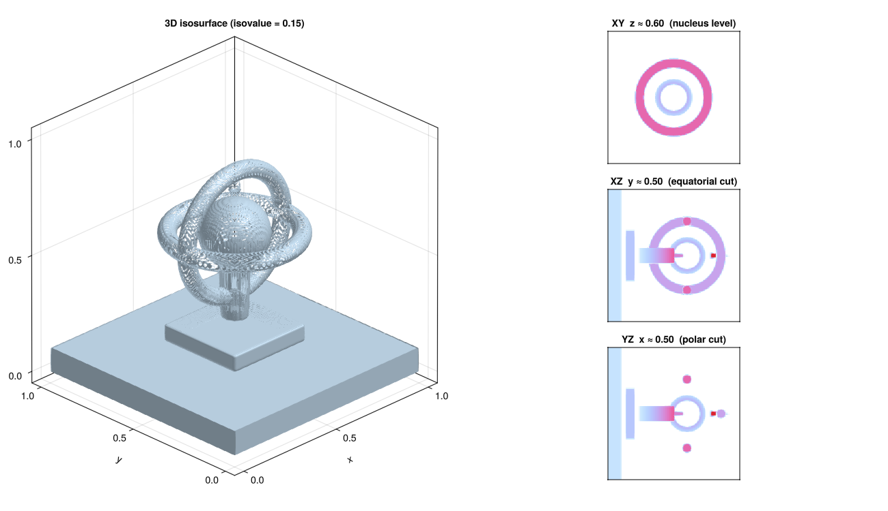
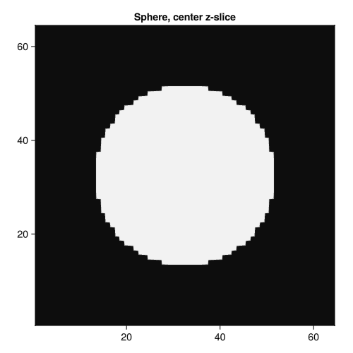
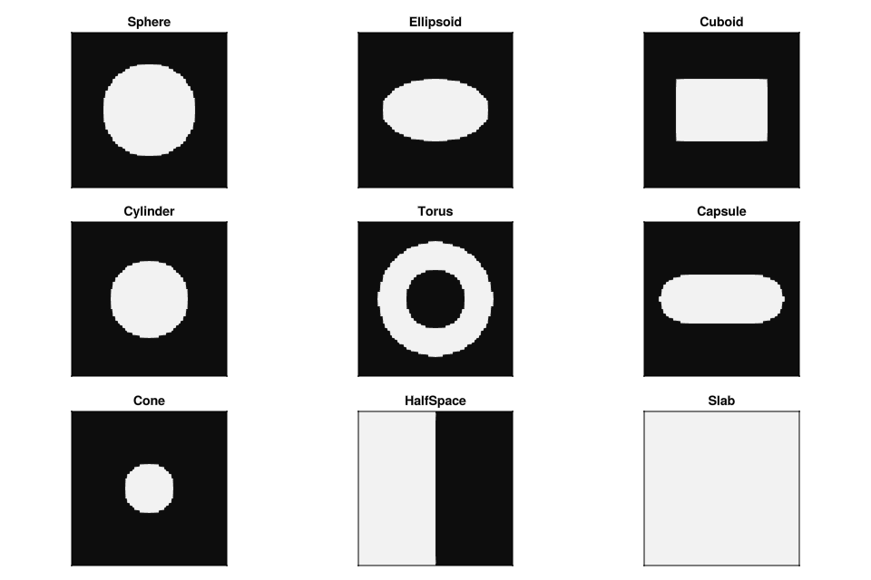
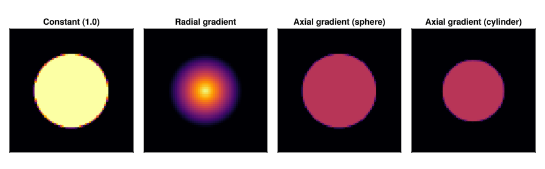
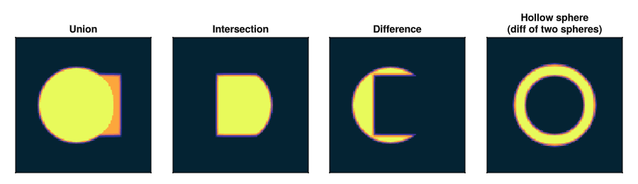
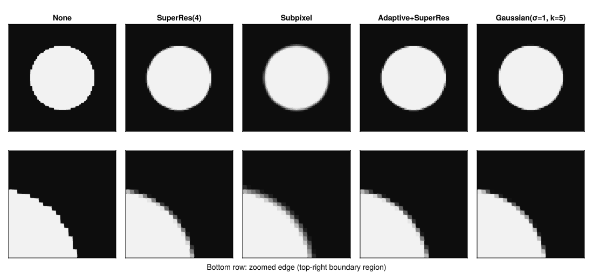

# VoxelShapes.jl

[](https://paulvirally.github.io/VoxelShapes.jl/stable)
[](https://paulvirally.github.io/VoxelShapes.jl/dev)
[](https://github.com/PaulVirally/VoxelShapes.jl/actions/workflows/CI.yml)
[](https://codecov.io/gh/PaulVirally/VoxelShapes.jl)
[](https://github.com/JuliaTesting/Aqua.jl)
[](https://juliahub.com/ui/Packages/General/VoxelShapes)
[](LICENSE)



Place geometric shapes into a 3D voxel grid. Each shape carries a fill value (or
a gradient function), and you can pick how boundary voxels are blended when a
surface doesn't line up with the grid. Call `rasterize(geometry, region)` to get
a plain Julia array.

The main use case is any grid-based simulation that needs per-voxel scalar or
vector properties defined by geometry.

## Installation

```julia
using Pkg
Pkg.add("VoxelShapes")
```

## Quick start

```julia
using VoxelShapes

N = 64
sphere = FillableSphere((0.5, 0.5, 0.5), 0.3, 1.0)

geometry = Geometry([sphere], 0.0, NoAntiAliasing()) # what to draw
region = Region((N, N, N), (1//N, 1//N, 1//N), (1//2, 1//2, 1//2)) # where to sample

arr = rasterize(geometry, region) # returns a 64×64×64 Float64 array
```

`Geometry` holds the shapes, the background value, and the anti-aliasing
strategy. Resolution is determined by you rasterization region (`Region`) which
is independent of the geometry. A `Region` holds the cell count, voxel size, and
center of a single block of uniform voxels. Voxel size and center location must
be specified as `Rational` types to make sure there are no floating point
rounding errors. To add more shapes, use `add_shape(geometry, shape)`, which
returns a new `Geometry` with the shape appended.



## Shapes

Nine primitive shapes are included.



```julia
FillableSphere(center, radius, fill_val)
FillableEllipsoid(center, (rx, ry, rz), fill_val)
FillableCuboid(center, (lx, ly, lz), fill_val)      # lx/ly/lz are full side lengths
FillableCylinder(center, radius, half_height, fill_val; axis=3)
FillableTorus(center, major_radius, minor_radius, fill_val; axis=3)
FillableCapsule(point_a, point_b, radius, fill_val)
FillableCone(center, base_radius, top_radius, half_height, fill_val; axis=3)
FillableSlab(point, normal, half_thickness, fill_val)
FillableHalfSpace(point, normal, fill_val)
```

`FillableCone` with `top_radius = 0` is a true cone. To make a frustrum, you
must have unequal nonzero radii.

Shapes are evaluated in the order they were added to the geometry. The first
shape whose containment test passes claims the voxel. A shape that covers a
voxel but produces a value equal to the background is treated as transparent
there, so the next shape (or the background) shows through. This lets you punch
holes by filling with the background value, but it also means you cannot
deliberately paint the background value on top of a lower layer.

## Fill functions

The fill value argument can be any constant, but if you want spatial variation
you can pass one of the built-in fill structs instead.



```julia
# Radial gradient: interpolates from inner_value at the center to outer_value at the surface
f = RadialGradient(1.0, 0.0) # bright core, transparent shell

# Axial gradient: interpolates along a local axis from -1 to +1
f = AxialGradient(3, 0.0, 1.0) # dark bottom, bright top (local z-axis)
```

Because the convenience constructors wrap their `fill_val` argument in a
closure, using a gradient requires the inner struct constructor. See
`examples/03_fills.jl` for the full syntax.

Any callable that takes a 3-tuple of local coordinates and returns a scalar
works as a fill function, as long as it is `isbits`-compatible (required for GPU
use).

## CSG

Shapes can be combined with boolean operations.



```julia
csg_union(a, b)     # inside a or b
csg_intersect(a, b) # inside both a and b
csg_diff(a, b)      # inside a but not b
csg_complement(a)   # everything outside a
```

Fill always delegates to the first operand. Operations can be nested.

## Rotation

`Rotated` wraps any shape and maps query points into local frame before the
containment test. This means every shape gets rotation without needing its own
rotation logic.


```julia
Rotated(shape, (αx, αy, αz)) # intrinsic ZYX Euler angles in radians
Rotated(shape, axis, angle)  # axis-angle
Rotated(shape, R)            # explicit 3×3 SMatrix
```

The pivot defaults to `center(shape)`. You can pass an explicit pivot as the
last argument.

## Anti-aliasing

When a surface doesn't align with the voxel grid, boundary voxels need some
treatment.



`NoAntiAliasing` is a hard point test at the voxel center.
`SuperResolutionAntiAliasing(n)` divides each voxel into n³ sub-samples and
averages them. `SubpixelAntiAliasing` uses the signed distance function to
estimate coverage analytically, one evaluation per voxel, with no inner loop.
`GaussianAntiAliasing(σ, kernel_size)` convolves the boundary with a Gaussian
for a softer edge. `AdaptiveAntiAliasing(inner)` wraps any strategy and skips
the stencil for voxels that are clearly inside or outside.

For most use cases `AdaptiveAntiAliasing(SuperResolutionAntiAliasing(4))` is a
good starting point.

## Interpolation

You can choose many different interpolation shcemes to choose how to combine
sub-voxel samples during anti-aliasing.

| Strategy | Description |
|---|---|
| `LinearInterpolation()` | Weighted arithmetic mean. The default. |
| `HarmonicInterpolation()` | Weighted harmonic mean. For positive-definite quantities. |
| `GeometricMeanInterpolation()` | Weighted geometric mean. Also for positive-definite quantities. |
| `MaxInterpolation()` | Maximum sample value, ignoring weights. |
| `MinInterpolation()` | Minimum sample value, ignoring weights. |
| `DielectricInterpolation()` | Linear interpolation of electric susceptibility χ. |
| `MetalInterpolation()` | Interpolates via the complex refractive index, then recovers χ. |

The last two implement interpolation schemes from computational electrodynamics.

## GPU

```julia
using CUDA
arr = rasterize(geometry, region, CuArray) # runs the rasterization kernel on the GPU
```

The geometry, all shapes, and all fill functions must be `isbits`-compatible.
Custom fill functions must also be `isbits`. That is, you may not write closures
that capture heap-allocated objects.

## Grids and refinement

A `Region` is a block of uniform voxels. Sometimes you need higher resolution
near a surface and can get away with coarser voxels further away. For these
cases, you can use a `CompositeGrid` of several `Region`s with different
resolutions. The `refine` function takes a coarse `Region` and a bounding box,
and carves out a smaller, finer `Region` inside it.

```julia
grid = refine(Region((8, 8, 8), (1//16, 1//16, 1//16)),
              ((0//1, 0//1, 0//1), (1//8, 1//8, 1//8)))
```

This carves the region into a refined core plus the six leftover slabs that fill
out the rest of it, yielding seven regions in total `refine(grid, shape;
factor=2, padding=0)` does the same starting from a shape's `bounding_box`
instead of a box you specify by hand. This makes refining around a shape easy:

```julia
sphere = FillableSphere((0.0, 0.0, 0.0), 0.05, 1.0)
grid   = refine(Region((8, 8, 8), (1//16, 1//16, 1//16)), sphere; factor=2, padding=1//16)
```

`rasterize(geometry, grid)` returns a `CompositeField`. This is a flat vector,
with one entry per voxel, region by region in the order from `refine`.
`vec(field)` is that flat vector, and `collect(eachregion(field))` gives one 3D
array per region. Both `vec(field)` and `collect(eachregion(field))` line up
with `regionview` and `eachregion`. `regrid(field)` resamples the whole thing
onto one uniform array at the finest scale present. This is nice which is for
quick visualizations (e.g., for `heatmap!`), but it is very memory intensive as
it puts everything on the same fine grid. See `examples/08_refine.jl` and the
[Grids and
refinement](https://paulvirally.github.io/VoxelShapes.jl/stable/grids/) docs
page for the full picture, including a slice coloured by region index.

## Extending

To implement a custom shape, define:

```julia
Base.in(point::NTuple{3,T}, shape::MyShape) # containment test
Base.fill(shape::MyShape, voxel_center::NTuple{3,T}, voxel_size::NTuple{3,T}) # fill value
VoxelShapes.interpolation(shape::MyShape) # interpolation strategy
VoxelShapes.sdf(shape::MyShape, point::NTuple{3,T}) # signed distance function
```

`has_exact_sdf` defaults to `false`. Set it to `true` if your SDF is a true
Euclidean distance, which lets `AdaptiveAntiAliasing` skip boundary checks for
interior and exterior voxels.

Optionally, define `VoxelShapes.bounding_box(shape::MyShape)` to return a
conservative axis-aligned `(lower, upper)` box (infinite extents as `±Inf`). The
default is all-infinite, so `refine(grid, shape)` on a shape without this method
refines the whole grid instead of just the neighbourhood of the shape.
