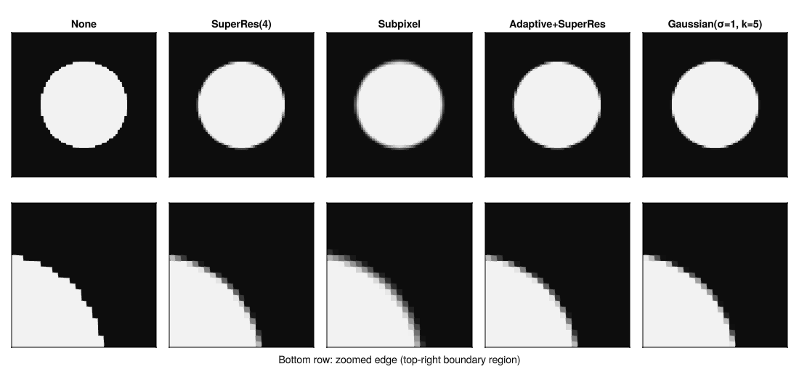

# Anti-aliasing

When a shape boundary doesn't land on a voxel edge, something has to happen at the boundary voxels. The five strategies below cover most use cases.



## Strategies

`NoAntiAliasing()` is a point test at the voxel center. Fast and binary. Use it when boundary accuracy doesn't matter, or as a baseline.

`SuperResolutionAntiAliasing(n)` divides each voxel into an n³ sub-grid and averages the results. Accurate at any curvature, but it does n³ times the work per voxel.

```julia
SuperResolutionAntiAliasing(4)            # 4³ = 64 samples per voxel
SuperResolutionAntiAliasing((4, 4, 2))    # anisotropic
```

`SubpixelAntiAliasing()` reads the SDF at the voxel center and estimates coverage from it. One evaluation per voxel, no inner loop, GPU-friendly. It assumes the boundary is locally flat, so accuracy drops when a voxel is large compared to the surface's radius of curvature. Needs `sdf`.

`GaussianAntiAliasing(σ, kernel_size)` convolves the boundary with a Gaussian, giving a soft edge instead of a crisp step. Kernel size must be odd.

```julia
GaussianAntiAliasing(1.0, 5)                    # isotropic σ=1, 5×5×5 kernel
GaussianAntiAliasing((1.0, 1.0, 2.0), (5, 5, 7)) # anisotropic
```

`AdaptiveAntiAliasing(inner)` wraps any other strategy and skips its stencil for voxels clearly inside or outside the surface (when `has_exact_sdf(shape)` is true). Only boundary voxels pay the full cost.

```julia
AdaptiveAntiAliasing(SuperResolutionAntiAliasing(4))  # recommended default
AdaptiveAntiAliasing(SubpixelAntiAliasing())
```

## Choosing

| Strategy | Cost | Edge quality | Notes |
|---|---|---|---|
| `NoAntiAliasing` | O(1) | Staircase | Good for prototyping |
| `SubpixelAntiAliasing` | O(1) | Smooth | Best speed/quality tradeoff |
| `AdaptiveAntiAliasing(SuperRes(n))` | O(n³) at boundary | Accurate | Recommended for final runs |
| `SuperResolutionAntiAliasing(n)` | O(n³) everywhere | Accurate | Only use when every voxel is near a boundary |
| `GaussianAntiAliasing` | O(kernel³) | Soft | For intentionally blurred edges |

The AA strategy is set on the `World`, not the shape, so it applies to all shapes in the scene.

See the [API reference](@ref "API reference") for full signatures.
