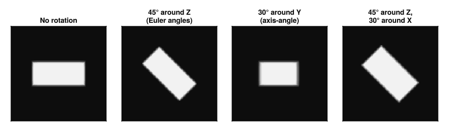

# Rotation

`Rotated` wraps any shape and maps query points into local frame before the
containment test.



## Constructors

```julia
# Intrinsic ZYX Euler angles (radians)
Rotated(shape, (αx, αy, αz))

# Axis-angle
Rotated(shape, axis, angle)

# Explicit 3×3 rotation matrix (world-to-local, orthonormal)
Rotated(shape, R)

# Any form with an explicit pivot point
Rotated(shape, (αx, αy, αz), pivot)
Rotated(shape, R, pivot)
```

The pivot defaults to `center(shape)`. Shapes without a natural center
(like `FillableCapsule`) need an explicit pivot to rotate about anything
other than the origin.

Rotation is isometric. The SDF is preserved exactly. `has_exact_sdf`
delegates to the inner shape.

## Example

```julia
using VoxelShapes

box = FillableCuboid((0.5, 0.5, 0.5), (0.6, 0.3, 0.2), 1.0)

# 45° around z
tilted = Rotated(box, (0.0, 0.0, π/4))

# 30° around an arbitrary axis
tilted2 = Rotated(box, (1.0, 1.0, 0.0), π/6)

geometry  = Geometry([tilted], 0.0, SubpixelAntiAliasing())
region = Region((64, 64, 64), (1 // 64, 1 // 64, 1 // 64), (1 // 2, 1 // 2, 1 // 2))
arr    = rasterize(geometry, region)
```

See the [API reference](@ref "API reference") for full signatures.
